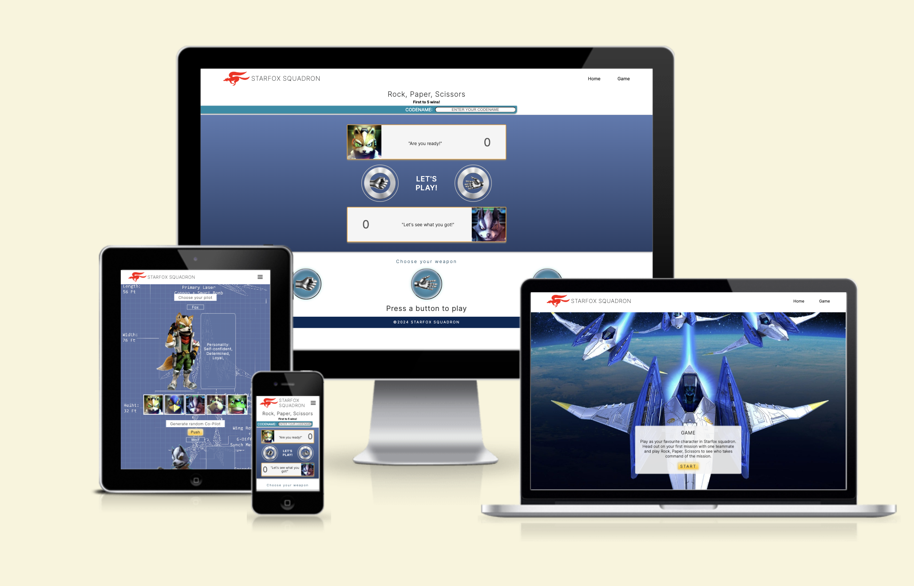
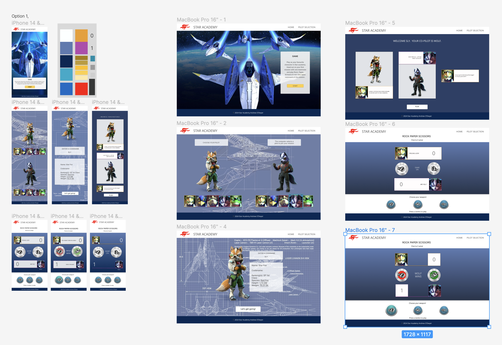
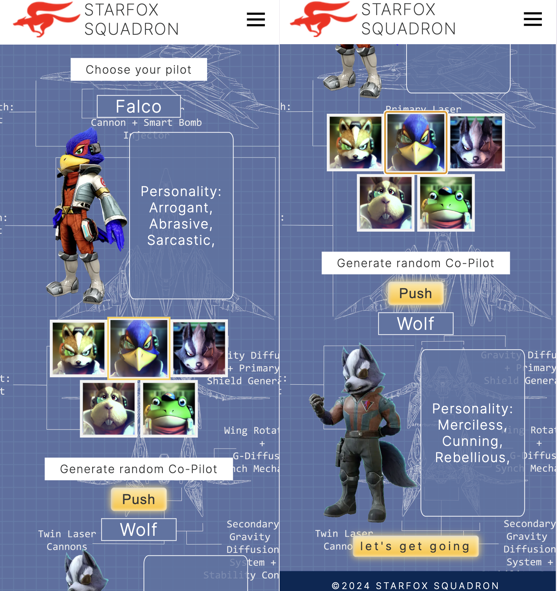
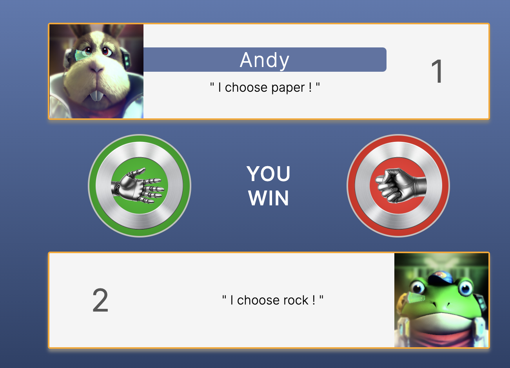
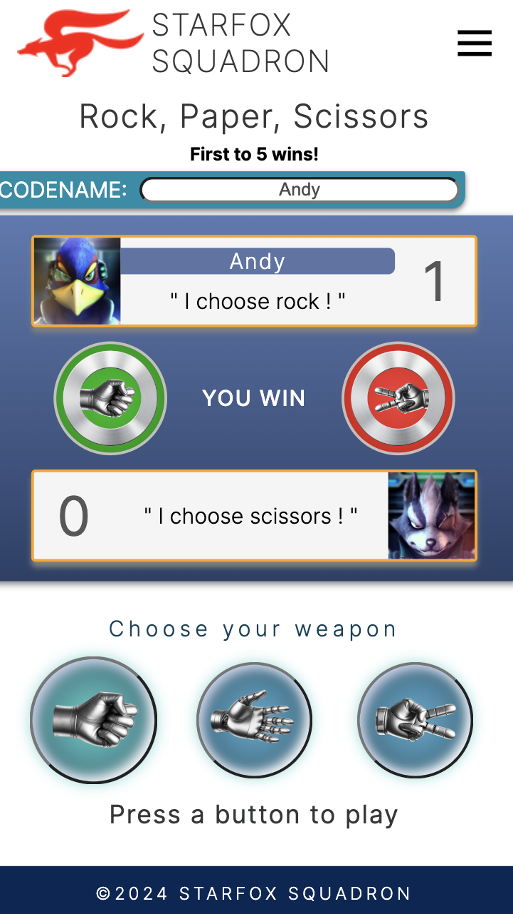

# StarFox Squadron

Target Audience 
The target audience for this Rock Paper Scissors, Starfox themed game would be primarly be people with interest in starFox. Starfox Fans: This game would appeal to fans of the Starfox franchise, particularly those who enjoy the characters and their characteristics. They would likely be interested in any new game featuring their favourite characters. Fox, Falco, Wolf, Peppy and Slippy
Others might be:
- Casual Gamers: The simple gameplay mechanics of Rock Paper Scissors combined with the game idea of playing rock, paper, scissors to choose who takes command of the mission, could attract casual gamers looking for a quick and fun experience without a steep learning curve.
- Families: The easy to navigate design means it would be accessible to people of all ages. A fun activity to enjoy if you had a few minutes to spare.
-Nostalgia Seekers: People who have fond memories of playing older Starfox games might be drawn to this new iteration, especially if it incorporates elements that remind them of the classic titles.
- Designers: This is a very visually appealing design. The layout, colour, typography and UX of this game would appeal to creative people.
Overall, the game could have broad appeal, for anyone to engage with over multiple sessions due to it multi-layer aspect. The character selection & computer random selection and following this a rock paper scissor game that has a multitude of features. 

## UX & UI Design

### Wireframe and Prototype

The tool Figma was used for the Wireframe and Prototype. You can view my [figma page here](https://www.figma.com/file/1tfeavw7rxnhvLsKXqHWaR/StarFox?type=design&node-id=0-1&mode=design&t=xgaCVeO8ZfCMJny2-0)

### Responsive Design

- This website is a mobile-first design. At the planning stage, emphasis was put into the design of a mobile website, followed by up-scaling for larger devices.
- To achieve this, I used a component-based approach. Inside the rock paper scissors game I devided the game section up into 3 main areas.
  - Information section: The game name, conditions to win and the input area for the player name/codename
  - The Scoreboard: 
  - The 3 buttons for the player to choose from. Rock button, paper button and scissors button. This player choice section is flex-wrap so can more if needed on very small devices
These sections are designed to be realtive to the screen size so they would be visually appealing on any device.

### Mapping

- This is a three page design layout. On the home page, is a hero or background image of a classic starfox scene. Infront of this to the bottom of the screen is the information section. A short outline of the games concept. A call to action button "start" is lighlighted in yellow/orange under the game information.
- The second page is the character/pilot selection page. When planning out this page on the figma wireframe, I knew I needed a longer layout. A large highlighted pilot image and info beside then, a selection bar containing the headshots of the pilots to choose from (5 choices) and the random computer selected image your opponent. To achive this layout I want with a scroll design. This scroll layout will be intuitive to the user and will make them feel at ease. At the end of the page after making your choice and seeing the computer pilot, the user sees a call to action, a “Let's get going” button. 

- The rock paper scissors game page was separated to the pilot selection. It's a natural progression in most character selection games. Something the user will be expecting.
- The name of the game immediately focuses the player, following this is the iput area for the players name
- As outline above, the gameboard was comprised of the players pilot, their selection in words ("I choose Rock") and their score. Between the 2 character block are the results. The results section holds the players choice as an image, the win, loose, draw text result as text and lastly the computers random choice image.
  - The pilot choice image changes with relation to their selection, Rock Paper or Scissors.
  - The backgrounds of the images change colour to highlight the winner, green for win, red for loose.

- Rock Paper Scissors Buttons. I placed the 3 button choices at the bottom of the page. This was done in part for quick selection on mobile devices. Thumbs are placed at the bottom of screen. Secondly if the buttons where in the middle of the screen, it would be challanging to see what the computer choose.

### Colours & Font

- The colour palette is made up of dark blues, greens and complemented with gold and orange. A split complementary scheme, in mid-strength tones to give a fun energetic feeling that is pleasing to the eye.
- The use of white text on the darker values/tones and dark grey text on lighter values, means the text is easy is read.   
- The Font used is Inter with a weight of 200-400 and a websafe sans-serif font.
- A Dark grey colour (#363737) was used on the majority of the text over white background. The pilot section uses white for the pilots name and pilot info to help it stand out from the other text. By using this 2 tone approach in the pilot section, the text ties in with the lighter blueprint background. 

## Features 

### Navigation Bar

- The full responsive navigation bar includes links to the Home page, Our Tour section (#tour) and Book page and is identical on both pages to allow for easy navigation. The CC Ghost Tour logo will also take the user back to the Home page.
- This navigation bar will allow users to move between sections and pages without using the back button.

### Button & links

- The button was designed to stand out, to be easily visible from the rest of the page. The submit buttons in the "book" page has an "affordance"(Don Norman) with the text "send".
- The orange colour is in contrast as it is a complementary colour to the blue and green on the page. 
- The image below shows the button without hover on the left and with hover on the right. As you can see, the gradient changes direction and the buttons sides expand. 
- This subtle change is a visual cue that is in keeping with the use of gradients throughout the website.

- The nav links in the menu change colour to silver on hover. Giving a visual Feedback.

### The landing page image

- The landing page consists of an appealing comic book style image of two skeletons looking over a cathedral at night. Next to the image is a h2 text block, that provides the user with the businesses unique selling point. The image will appeal to the younger member of the family while the text gives the parents (guardians) the sales pitch. 

- A colour gradient is used in the first section and this gradient is mirrored further down the page in the map section. The mirrored gradients complement each other and frame the tour cards between.

### Tour Description

- The tour description section will allow the user to see that this is a fun, entertaining tour, presented by knowledgeable, comedic guides that has a strong Cork manner.
- The "meet your guides" section will give a better insight into two of the companies guides.
- This section has a transition when moving from mobile to larger screens. The two cards turn horizontal on larger screens and move in from the left.

- These sections are cards (image and text containers) with a drop shadow. The drop shadow effect gives a dynamic feel to the site.

- The Route section, will emphasis that this is an 18th century period tour. Giving the user a visual idea of the layout of the city

### Call to Action

The last section on the main page is the "Get in Touch" or call to action.
It gives a prompt to "Get in Touch" and contains a "Book Now" button.
As described earlier in the mapping paragraph, this button empowers the user. Moving them forward.

### The Footer

- The footer section includes links to the relevant social media sites for CC Ghost Tour. The links will open to a new tab, allowing easy navigation for the user. 
- These well know icons/logos are familiar to the user and encourages them to see more on those platforms.
- The footer also contains the business address and the copyright.

### Book Page

This page will allow the user to send contact details in order to make a booking.
- This form asks for the following. First Name, Last name, Email Address, Phone number, Booking Date & Your message. 
- All fields are required and a valid email address (including @,) needs to be entered.
- After filling in all the required forms, the user will be prompted to submit the form with the “Send” button.
- Behind the form is the map and a transparent green overlay.

### Features Left to Implement

- I'd like to introduce a hover page. It will display after clicking the form submit button, to indicate the form was sent successfully.

## Testing 

- HTML
  - No errors were returned when passing through the official [W3C Validator] (https://validator.w3.org/nu/?doc=https%3A%2F%2Fandrewodwyer.github.io%2FCork-City-Ghost-Tours%2Findex.html)
- CSS
  - No errors were found when passing through the official [(Jigsaw) Validator] (https://jigsaw.w3.org/css-validator/validator?uri=https%3A%2F%2Fandrewodwyer.github.io%2FCork-City-Ghost-Tours%2Findex.html&profile=css3svg&usermedium=all&warning=1&vextwarning=&lang=en)
- Accessibility
  - The colour and font used make it very easy to read the text while still pleasing to the eye.
  - I used Lighthouse in DevTools to confirm that every page scores well.
  - The left image in the picture below is the lighthouse score given for desktop. The right image is the score given for mobile.

### Browser Testing

- The site has been tested on the following browsers: Chrome, Safari, firefox & Edge. The layout and functionality was consistent throughout the testing. links, navigation and form submit all work as intended.

### Manual testing

Actions and results. 
- On click, CC Ghost Tour text/logo brings you to the home page.
- Navbar buttons: when clicked, they take you to different sections or pages. 
- Book/submit button: when clicked, it will show the code institute form submitted
- Name, email, phone, date & your message inputs are all required on the form in booking page: If not filled out correctly, it prompt user to do so before allowing them to submit the form. 
- Social link icons (X, instagram, facebook, you-tube): when clicked, opens pages for those particular social networks.
All work correctly.

### Fixed Bugs

- Input field height in contact section. I wanted one row input field for the name and email boxes but I wanted 4 row for the message. This was done by adding  textarea instead of input element. textarea is not self closing and this took me a few tries to work out. Secondly I wanted each of the first 4 fields to be the same height. The auto height I felt was too small so I added a class to make the input fields 25px high and another css rule to make the textarea field 150px high. 
- Centre Form. I was having trouble making the form in the contact page centred on the page. The resolve was to add margin:auto; to the booking-form and also padding:5% to the outer div class=“transparent-colour”. The padding gave breathing space around the booking form.
- I wanted to stack the sections and divs on mobile, so the images showed first and then the text box. This was for devices with screen width less than 769, so the text could be easily read. 
When the screen went over 769px, the divs would be placed side by side in the section (container/card). The image div on left and text div on right. This was the design for the hero section and the “our tours” section. 
The div that followed, named “meet your guides” has two “our-guides” divs. These are stacked like the first two for mobile. However on larger screens, they would move to be in a row. The “our-guide” divs would be side by side.
This was solved using flex-direction:column in the “guide-section” section and flex-direction:row as a media query in the “our-guides” div.
Two containers (both having a class=“our-guides”) with an attribute of flex-direction: row. 
I added a class=“image-and-text” to these divs containing the image and text cards. The outer “meet your guides” container had a flex property of column, so the “our-guides” section showed side by side.

### Unfixed Bugs

There are no unfixed bus.

## Deployment

- Log in to GitHub and select CC ghost tour repository.
- From this repository, navigate to "Settings" (This is at the top of the page).
- when in settings, navigate to pages from the left-hand menu.
- In source select “Deploy from a Branch” in the drop down menu.
- In branch select “main”. The folder next to it will be “/(root)”
- At this point you click “Save”
- Your site is now being deployed.
- After several minutes the site was deployed.
- A link to the deployed site is at the top of this page, click “Visit site”
- Alternatively, To get access to the deployed site, click on the “Code” tab of the repository.
- On the right-hand side under “environments” click on “GitHub-pages”
- In the newly opened pages, click on “view deployment”
[live site](https://andrewodwyer.github.io/Cork-City-Ghost-Tours/)

## Credits 

- Code-institute:
  - The navigation bar and footer originally code was originally sourced from the Love Running Project at Code Institute. The form on the booking Page was also inspired by the Love Running project. However, none of these remain in their original form. Additional code was added to css and html.
- Montor Support: Spencer Barriball
- Tutor Support: Tutors at Code institute
- Don Norman's book "The design of everyday things"
- W3schools: 
  - I used w3schools to plan the button and button:hover css layout & colour.
[button css](https://www.w3schools.com/css/tryit.asp?filename=trycss_buttons_hover)
  - Semantic elements like section, div etc
[Semantic](https://www.w3schools.com/html/html5_semantic_elements.asp)
- HubSpot:
[Tutorial on Git & Github](https://product.hubspot.com/blog/git-and-github-tutorial-for-beginners)
- Stackoverflow:
  - I got a better understanding of flexbox from stackoverflow.
[setting distance in flex](https://stackoverflow.com/questions/20626685/how-do-i-set-distance-between-flexbox-items)
  - Setting alt text in background images in CSS
[using title instead of alt](https://stackoverflow.com/questions/4216035/css-background-image-alt-attribute)  
### Content 

- The text for the Home page was written by the developer, Andrew O'Dwyer.
- The icons in the footer were taken from [Font Awesome](https://fontawesome.com/)
- Favicon: from icons8.com https://icons8.com/icons/set/favicon-ghost I was able to get a stock ghost icon and change the colours to suit my colour palette.
- Photoshop was used for cropping and resizing

### Media

- The images used on the home page are AI generated in bing, powered by chatgpt Dall-e. https://www.bing.com/images/create/?ref=hn
- The 18th century map used for the booking page was taken from https://www.linkedin.com/pulse/corporation-cork-city-ireland-agreed-make-provision-scheme-holohan
- These images were then resized using https://imageresizer.com/