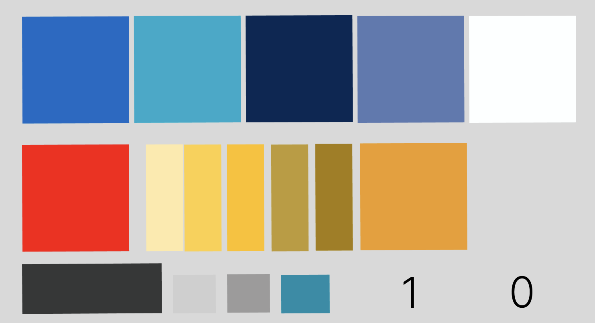
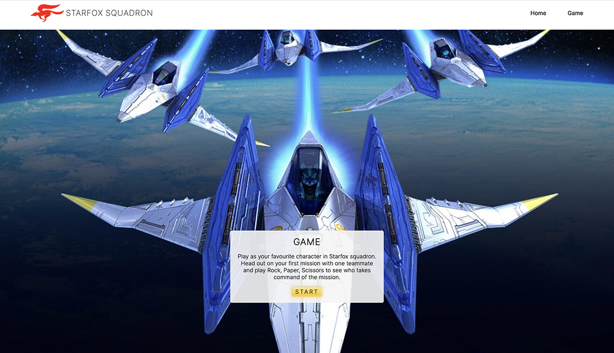
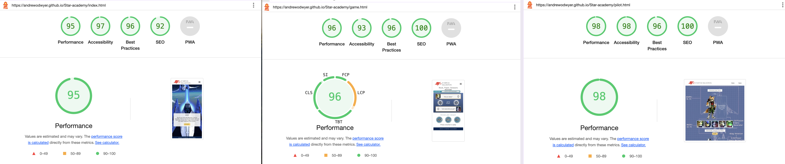

# StarFox Squadron
A StarFox Themed, Rock Paper Scissors game created by Andrew O'Dwyer.

## Game concept:
- Play as your favourite character in Starfox Squadron. Head out on your first mission with one teammate and play Rock, Paper, Scissors to see who takes command of the mission. 

## Project goals
The concept around the game was to build the rock, paper, scissors game into a StarFox themed character selection game. I wanted the game to have multiple layers of interest. A character selection page, where the player can choose between a number of characters. Characters information would be displayed beside them giving the player more insight into their chosen character. Those chosen pilots would then be brought onto the following Rock, Paper, Scissors game area. The game should feel nostalgic for older players and fun and easy to play for younger players.

## User Stories

- They want a game that is easy to navigate, from home/info section to game section and back again.
- A quick unterstanding of the concept of the game.
- The user want a natural flow in the game from intro to character select and the main game.
- They want to be able to go back and choose another pilot when they have completed the rock, paper, scissors game.
- They want to see their score, a visual reference if they won or lost and a conclusion to the game, ie, first to 5 wins.

### Site Owner Goals
- The owner wants to make sure the game isn't too complicated.
- A game that feel competitive so it will be shared and talked about
- A design that is visually appealing, that reflect the style of the origional StarFox game.

### Target Audience 
The target audience for this Rock Paper Scissors, Starfox themed game would primarly be people with interest in starFox.
- Starfox Fans: This game would appeal to fans of the Starfox franchise, particularly those who enjoy the characters and their characteristics. They would likely be interested in any new game featuring their favourite characters. Fox, Falco, Wolf, Peppy and Slippy
- Others might be:
  - Casual Gamers: The simple gameplay mechanics of Rock Paper Scissors combined with the game idea of playing rock, paper, scissors to choose who takes command of the mission, could attract casual gamers looking for a quick and fun experience without a steep learning curve.
  - Families: The easy to navigate design means it would be accessible to people of all ages. A fun activity to enjoy if you had a few minutes to spare.
  - Nostalgia Seekers: People who have fond memories of playing older Starfox games might be drawn to this new iteration, especially if it incorporates elements that remind them of the classic titles.
  - Designers: This is a very visually appealing design. The layout, colour, typography and UX of this game would appeal to creative people.
Overall, the game could have broad appeal, for anyone to engage with over multiple sessions due to it multi-layer aspect. The character selection, computer random selection and the rock paper scissor game has a multitude of features. 

## UX & UI Design

### Wireframe and Prototype

The tool Figma was used for the Wireframe and Prototype. You can view my [figma page here](https://www.figma.com/file/1tfeavw7rxnhvLsKXqHWaR/StarFox?type=design&node-id=0-1&mode=design&t=xgaCVeO8ZfCMJny2-0)

### Responsive Design

- This website is a mobile-first design. At the planning stage, emphasis was put into the design of a mobile website, followed by up-scaling for larger devices.
- To achieve this, I used a component-based approach. Inside the rock paper scissors game I divided the game section up into 3 main areas.
  - Information section: The game name, conditions to win and the input area for the player name/codename
  - The Scoreboard: 
  - The 3 buttons for the player to choose from. Rock button, paper button and scissors button. This player choice section is flex-wrap so it can move if needed on very small devices.
- These sections are designed to be relative to the screen size so they would be visually appealing on any device.

### Mapping

- This is a three page design layout. The info page, the pilot selection page and the rock paper scissors game page.
- Page one index.html holds the information on what the game is about.
- Page two contains the pilot section. The player will make a choice between 5 pilots. The chosen pilot will be displayed in full when the headshot it selected.
There will be a button below for a random computer pilot and their full length display. Following this is a button to move to the next section. It gives a prompt to "Let's get going". A call to action.
- The rock paper scissors game page was separate to the pilot selection. It's a natural progression in most character selection games. Something the user will be expecting. This is a classic, well know game with little to no learning curve. 3 buttons to choose from and a indication of the results. I decided to have a limit to the game. A conclusion of first to 5 wins.

### Colours & Font

- The colour palette is made up of dark blues, greens and complemented with gold and orange. A split complementary scheme, in mid-strength tones to give a fun energetic feeling that is pleasing to the eye.
- The use of white text on the darker values/tones and dark grey text on lighter values, means the text is easy is read.   
- The Font used is Inter with a weight of 200-400 and a websafe sans-serif font.
- A Dark grey colour (#363737) was used on the majority of the text over white background. The pilot section uses white for the pilots name and pilot info to help it stand out from the other text. By using this 2 tone approach in the pilot section, the text ties in with the lighter blueprint background. 

Font: Inter 200, 300, 400 from google font https://fonts.google.com/

## Features 

### Navigation Bar

- The full responsive navigation bar includes links to the Home page, and the game page. and is identical on both pages to allow for easy navigation. The red fox logo will also take the user back to the Home page.
- This navigation bar will allow users to move between sections and pages without using the back button.

### Button & links

- The button was designed to stand out, to be easily visible from the rest of the page. The yellow to orange buttons in the "home and pilot selection" pages have an "affordance"(Don Norman) with their text. Affordance in these cases have text of "start" and "push"
- The yellow to orange colour is in contrast as it is a complementary colour to the blue and green on the page. 
- The image below shows the button without hover on the left and with hover on the right. As you can see, the colour changes from yellow to orange.
- This distinct colour change is a visual cue to the user.

- The nav links in the menu change colour to silver on hover. Giving a visual Feedback to the player.

### The landing page image

- On the home page, is a hero or background image of a classic starfox scene. In front of this to the bottom of the screen is the information section. A short outline of the games concept. A call to action button "start" is highlighted in yellow/orange under the game information. The header of the game is a h3 and the information is in a p block of text. The information text will provide the user with a story, the concept and how the game will progress. The background image will appeal to both young and old. Fox in a spaceship comedic aspect for the kids and nostalgic aspect for the adults.

- A light white transparent div holding the information text make this section flow easily with the image.

### Pilot Selection page

- The second page is the character/pilot selection page. When planning out this page on the figma wireframe, I knew I needed the following:
  - A long layout design to hold all sections. 
  - A large highlighted pilot image and information beside them. 
  - A selection bar containing the headshots of the pilots to choose from (5 choices).
  - A random computer selected image of your opponent. 
- To achieve this layout I went with a scroll design. This scroll layout will be intuitive to the user and will make them feel at ease. At the end of the page after making your choice and seeing the computer pilot, the user sees a call to action, a “Let's get going” button. 
As described earlier in the mapping paragraph, this button empowers the user. Moving them forward.

### Rock paper Scissors game page

- The name of the game immediately focuses the player.
- The information below "First to 5 wins!" gives the player their goal.
- Codename input field. When the player enters their name/codename it appears in the pilot text section.
- Design of this input form:
I have given the game-name-form class a border-radius on the right of top 2px and bottom 10px to give it a design that is similar to the nav bar curve. Placing these design features in a number of placed give the design a balanced and considered feel.
- The game-board was comprised of the players pilot, their selection in words ("I choose Rock") and their score. Between the 2 character block are the results. The results section holds the players choice as an image, the win, loose, draw result as text and lastly the computers random choice image.
  - The chosen hand image changes with relation to their selection, Rock Paper or Scissors.
  - The backgrounds of the hand images changes colour to highlight the winner, green for win, red for loose and grey for a draw.
  - The plain red and green colours looked very flat so I used a radial-gradient to gave a more traffic light look. Lighter or brighter in the middle and darker as it goes out. I think this is more pleasing to the eye and not as jarring as the single colours.

- Rock Paper Scissors Buttons. I placed the 3 button choices at the bottom of the page. This was done in part for quick selection on mobile devices and Secondly if the buttons where in the middle of the screen, it would be challenging to see what the computer choose.
- Arcade buttons:
  -I wanted to make the 3 buttons look more 3 dimensional. To simulate an arcade button.
I created a inset border shadow for the blue area to give it a feeling it was extended. 
Secondly, I wanted to give an impression that the button was giving out light. To do this I gave a light green glow around the border. The link of css was 
box-shadow: 0 0 10px rgba(85, 208, 201, 0.7), rgb(200, 208, 231) 3.2px 3.2px 8px 0px inset, rgb(255, 255, 255) -3.2px -3.2px 8px 0px inset;

### The Footer

- The footer contains the game copyright. Text in white over the games dark blue colour.

### Features Left to Implement or Nice to have

- The next obvious next step would be to have a game or video showing the winner leading the mission.

## Testing 

- HTML
  - No errors were returned when passing through the official [W3C Validator] [index page](https://validator.w3.org/nu/?doc=https%3A%2F%2Fandrewodwyer.github.io%2FStar-academy%2Findex.html) [pilot page] (https://validator.w3.org/nu/?doc=https%3A%2F%2Fandrewodwyer.github.io%2FStar-academy%2Fpilot.html) [game page] (https://validator.w3.org/nu/?doc=https%3A%2F%2Fandrewodwyer.github.io%2FStar-academy%2Fgame.html)
- CSS
  - No errors were found when passing through the official [(Jigsaw) Validator] (https://jigsaw.w3.org/css-validator/validator?uri=https%3A%2F%2Fandrewodwyer.github.io%2FStar-academy%2Fpilot.html&profile=css3svg&usermedium=all&warning=1&vextwarning=&lang=en)
- JS
  - No errors were found [jshint] (https://jshint.com/)
- Accessibility
  - The colour and font used make it very easy to read the text while still pleasing to the eye.
  - I used Lighthouse in DevTools to confirm that every page scores well.
  - The left image in the picture below is the lighthouse score given for desktop. The right image is the score given for mobile.

### Browser Testing

- The site has been tested on the following browsers: Chrome, Safari, firefox & Edge. The layout and functionality was consistent throughout the testing. links, navigation text input all work as intended.

### Manual testing

Actions and results. 
- On click, StarFox/logo brings you to the home page.
- Navbar buttons: when clicked, they take you to different sections or pages. 
- All buttons ("Start", "push", "Let's get going" and "rock" "paper" "scissor" buttons): work as intended.
- Input form for name/codename on rock paper scissors game page shows the players name in the element above the text area.
- The endgame function works, sending an alert to state if the player won or lost. The alert will also show the players name if they have put it in the input field.

## Fixed Bugs

### Javascript

- Endgame function:
The game had no parameters to finish, it would go on and on indefinitely. To make the game more interesting it needed a finish line, an overall winner and loser. To accomplice this I created a function. It needed to do a number of things. It needed to stop when one person reached the score of 5, so I made a variable winningScore and set it = to 5. I used an if, else to see first if the playerScore was 5. If it was = to 5, an alert with a message “You Win!” was displayed. else alert “You Loose”. This function also had to reset all the scores, and text back to it’s original state. 

- playerHand
To change the players hand in the centre of the screen so you can see what you have selected, I make the id player-hand a variable playerHand_img (img to recognise it was an image) using the getElementById. I added this variable to the function "main" that is an addEventLister for button clicks. Each button, Rock, Paper and Scissors had separate buttons so it was a matter of adding the following line for each button eg, playerHand_img.src = ‘assets/images/circle_scissors_left.png' (scissors button in this case)
.src to find it on the DOM

- computerHand
The computer-hand was more difficult to show, as this was a random number. I made a variable computerHand_img like I did with playerHand but this time I had to add computerHand_img.src to the game function.
The line was similar to the playerHand 
playerHand_img.src = ‘assets/images/circle_(scissors)_left.png’ however the middle section had to be changed each time. 
I accomplished this by utilising ${computerChoice}. The line now reads like this:
computerHand_img.src = `assets/images/circle_${computerChoice}_left.png`;
Another option was the make the computer hand face the other way so it was positioned facing the players hand. I horizontally flipped the 3 hands in photoshop, named then _right and uploaded then, The javascript could now use those images. 

- Endgame() was first to ===5 but score didn't reach 5! The game reached 5 wins but the game function ended before the score was updated. It looked like it was only to 4.
  - To fix do this a needed to setTimeOut to the endgame() function. I started by having time out set to 3 seconds, however the score could of went up another point or 2 before reaching the 3 seconds. 200ms was what I used. Long enough for the score to increase to 5 (the winning score) but short enough that the game wouldn’t go past it.

- Two page game design meant that it was better to have 2 js files. However this made it more difficult to send the chosen pilot to the game page so the player image would change depending on the pilot selected.
  - It was suggested to use 2 js files, one for each part of the game, one to match with the pilot selection and another js file to match with the rock, paper, scissors game. 
  - I could then use Window localStorage to give a key and value to the pilots, so they can be used on the following page. The rock, paper, scissors game. 
  - I used sessionStorage over localStorage because the information stored would be gone when the page was closed.

- sending variable key and value to game page. 
  - I declared a variable with var in a global scope so it could be used outside the function. 
After this I was able to use playerSelected and computerSelected variable and their values after it went through the function changePilot.

### CSS style Bug

Flex reverse issue for computer div on rock paper scissors game:
- Score-box had a margin-right of 5px to bring it away from the edge for the players-cards. I used the same class (.player-cards) for the computer div (.comp). I flex reversed the player div for the aesthetics. With flex reverse, margin-right didn’t bring the number away for the edge. My resolve was to scrap margin-right and to just use margin of 5px around the number instead.

text-box sizing issue
- I used flex-grow of 1.5 on .text-box to increase the size of the text area in comparison to the image on left and score on right. However without a specific size, the whole .players-card div got too large on larger screens. I used width of 130px to resolve the issue.

### Unfixed Bugs

There are no unfixed bus.

## Deployment

- Log in to GitHub and select CC ghost tour repository.
- From this repository, navigate to "Settings" (This is at the top of the page).
- when in settings, navigate to pages from the left-hand menu.
- In source select “Deploy from a Branch” in the drop down menu.
- In branch select “main”. The folder next to it will be “/(root)”
- At this point you click “Save”
- Your site is now being deployed.
- After several minutes the site was deployed.
- A link to the deployed site is at the top of this page, click “Visit site”
- Alternatively, To get access to the deployed site, click on the “Code” tab of the repository.
- On the right-hand side under “environments” click on “GitHub-pages”
- In the newly opened pages, click on “view deployment”
[live site](https://andrewodwyer.github.io/Star-academy/index.html)

## Credits 

- Code-institute:
- I used two videos for instruction on how to create a Hamburger Menu: [nav-menu 1](https://www.youtube.com/watch?v=aNDqzlAKmZc) [nav-menu 2](https://www.youtube.com/watch?v=flItyHiDm7E). 
[Hamburger menu](https://www.youtube.com/watch?v=zuAmsj2EN54) Additional code was added to css and html to give it a unique look.

- Multiplayer section:
  - [Street fighter character selection](https://codepen.io/itslit/pen/RMMdZv)
  - [Character Selection](https://www.youtube.com/watch?v=ISeyrczkzGY)
- [Rock, Paper, Scissors tutorial](https://www.youtube.com/watch?v=jaVNP3nIAv0&t=1485s)
  - [Second, Rock, Paper, Scissors game](https://www.youtube.com/watch?v=3uKdQx-SZ5A)
  - [Character Selection resource](https://stackoverflow.com/questions/21043301/add-character-selection-function-to-multiplayer-game)
  - [Multi Character selection game](https://www.youtube.com/watch?v=M6sA8fvMCuA)
  - [StreetFighter Character Select](https://codepen.io/ryanparag/pen/PJqryW)

- Montor Support: Spencer Barriball
- Tutor Support: Tutors at Code institute

- JS scope [variable scope](https://www.w3schools.com/js/js_scope.asp)
- Dom eventListener 
- [Learn JavaScript DOM Traversal:](https://www.youtube.com/watch?v=v7rSSy8CaYE)
- [Learn DOM Manipulation In 18 Minutes](https://www.youtube.com/watch?v=y17RuWkWdn8)
- [Master JavaScript Loops - Guide to For, While, Do-While, Array, & Object Loops! Programming Tutorial](https://www.youtube.com/watch?v=Qchv8Htzgt4&t=329s)
- [textContent - Javascript DOM Tutorial For Beginners](https://www.youtube.com/watch?v=XW9ncbnfzZo)
- [Adding Image inside Button](https://www.codecademy.com/forum_questions/513d2cf2ba52df1c810038d5)
- [CSS background-image properties](https://www.w3schools.com/cssref/pr_background-image.php)
- [Flex and Flex-wrap](https://www.w3schools.com/cssref/pr_background-image.php)
- [CSS : centering absolute positioned text inside relative parent](https://stackoverflow.com/questions/18147642/css-centering-absolute-positioned-text-inside-relative-parent)
- [Local Storage & Session Storage](https://www.youtube.com/watch?v=-ZRDZyUjEEI)
- [Local Storage](https://www.youtube.com/watch?v=fYTTUBa-lPc&t=7s)
- [W3 School, window.localStorage](https://www.w3schools.com/jsref/prop_win_localstorage.asp)
- [Name Input with JS](https://www.youtube.com/watch?v=KB6Yg5hNrqc)
- Don Norman's book "The design of everyday things"
- W3schools: 
  - I used w3schools to plan the button and button:hover css layout & colour.
[button css](https://www.w3schools.com/css/tryit.asp?filename=trycss_buttons_hover)
  - Semantic elements like section, div etc
[Semantic](https://www.w3schools.com/html/html5_semantic_elements.asp)
- HubSpot:
[Tutorial on Git & Github](https://product.hubspot.com/blog/git-and-github-tutorial-for-beginners)
- Stackoverflow:
  - I got a better understanding of flexbox from stackoverflow.
[setting distance in flex](https://stackoverflow.com/questions/20626685/how-do-i-set-distance-between-flexbox-items)

### Content 

- The text for the Home page was written by the developer, Andrew O'Dwyer.

### Media

- Starfox Character information and images from [starfox information](https://www.charactour.com/hub/characters/view/Slippy-Toad.Star-Fox) and [starfox png](https://www.pngwing.com/en/search?q=star+Fox)
- Favicon: from [starfox png](https://www.pngwing.com/en/search?q=star+Fox)
- Photoshop was used for cropping and resizing of favicons and images. Most full shot images of the pilots had to be seperated from the background and changed to pngs